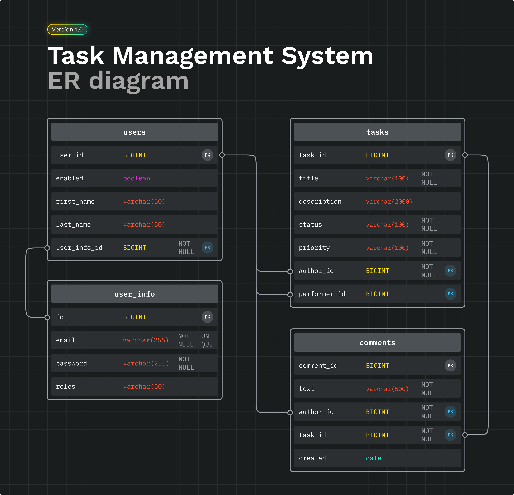

# Task Management System

Репозиторий приложения-системы управления задачами.  
Выполнено в рамках тестового задания от компании **Effective Mobile**.

## Используемые технологии

          


## Инструкция по запуску

Для развертывания приложения:

- Склонируйте репозиторий на локальный компьютер
- Соберите проект:

```bash
  mvn clean package spring-boot:repackage
```
```bash
  docker compose up
```

## Спецификация API

После локального запуска проекта OpenAPI доступен в Swagger:
http://localhost:8080/swagger-ui/index.html

## База данных

